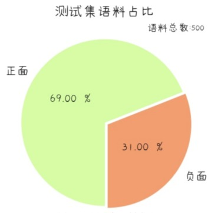
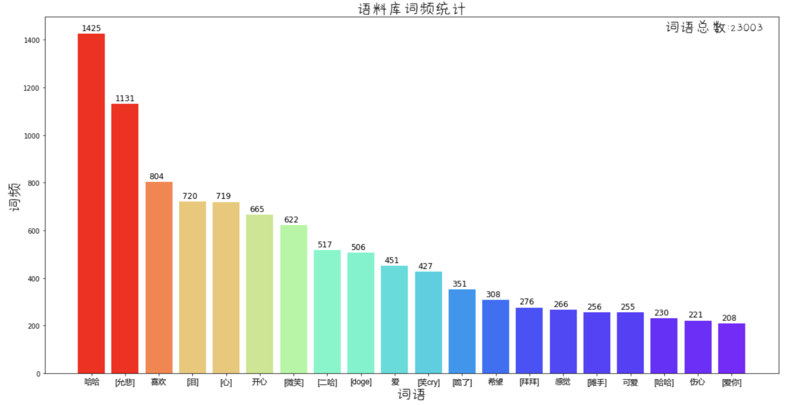
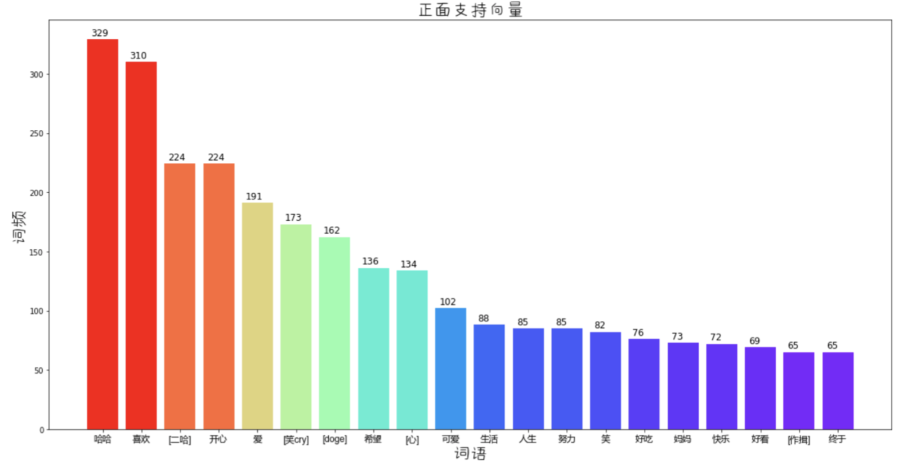
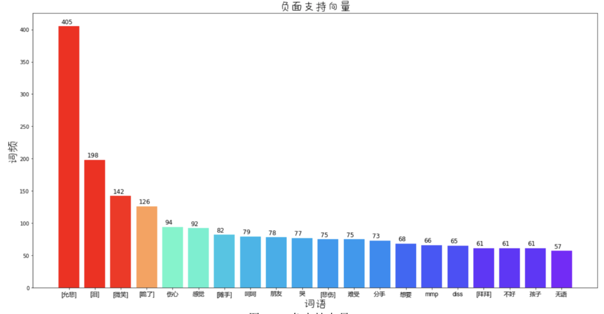

# 中文微博情感分类语料库

我的另一个项目对这个语料库进行了预处理, 用SVM/神经网络/LSTM/注意力机制分别训练了模型  
https://github.com/dengxiuqi/WeiboSentiment  

### 介绍
带情感标注的微博语料数量: 10000(train.txt)+500(test.txt)  
我本科毕业设计做微博情感NLP,需要对微博文本进行正负情感二分类  
网上相关语料库的质量都太低了,索性就自己写了个爬虫,一边标注一边爬  
因为是自己的毕设,所以标注是相当认真的,还请了朋友帮忙校验,其间还过滤掉了广告/太短/太长/表意不明等语料,语料质量是绝对可以保证的  
现在把它开源出来, 供做NLP的各位朋友学习、交流使用  

### 数据格式
* 文档的每一行代表一条语料  
* 每条语料的第一个数据为微博对应的`mid`,是每条微博的唯一标签,可以通过"https://m.weibo.cn/status/" + mid 访问到该条微博的网页(部分微博可能已被博主删除)  
* 第二个数据为情感标签, `0表示负面`, `1表示正面`  
* 其余后面部分都是微博文本  
* 微博表情都被转义成`[xx]`的格式, 如:   
被标记为`[doge]`  
被标记为`[允悲]`  
* 微博话题/地理定位/视频、文本超链接等都转义成了``的格式，使用正则可以很方便地将其清洗  

### 文件说明
`train.txt`:
* 10000条语料, 根据情感倾向二分类标注, 作为训练集
* 对负面语料轻微过采样, 正: 负 = 5497:4503  

`test.txt`:
* 500条语料, 依据情感倾向二分类标注
* 随机采样, 正: 负 = 7:3
* 作为测试集  

`topics/XXX.txt`:
* 100条不同主题的语料, 未进行情感分类标注(文件里全部标注为1), 可用于舆情分析测试  
* 当时还不会分布式爬虫, 所以爬的比较少, 不要嫌弃QAQ  

### 数据分析

|  训练集属性  | 平均数 | 0.95分位数 |
| :---: | :---: | :---: |
| 语料长度(含符号) | 80.9091  | 161 |
| 语料有效词数(含停用词)  | 38.74  | 87 |
| 语料句数  | 4.1653  | 11  |
PS: 语料长度的0.95分位数为161, 表示95%的语料长度都小于161

* 训练集/测试集词频统计, 已去停用词, 不同的分词方法得到的结果会略有差异

* 训练SVM后查看支持向量, 得到了正面/负面情感最强烈的一些词汇

### Author
欢迎交流  
wechat:`dengxiuqi007`  
2018.6